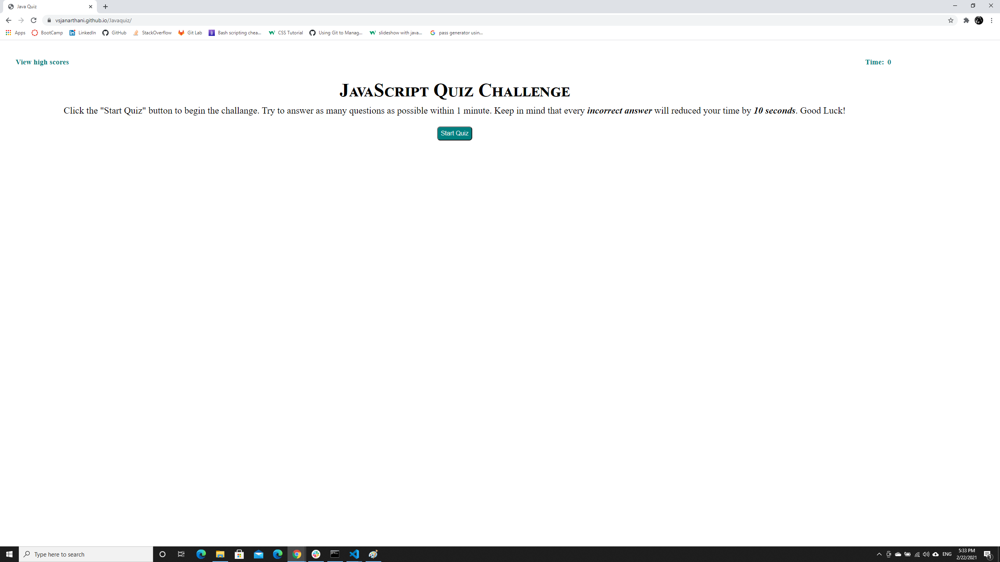
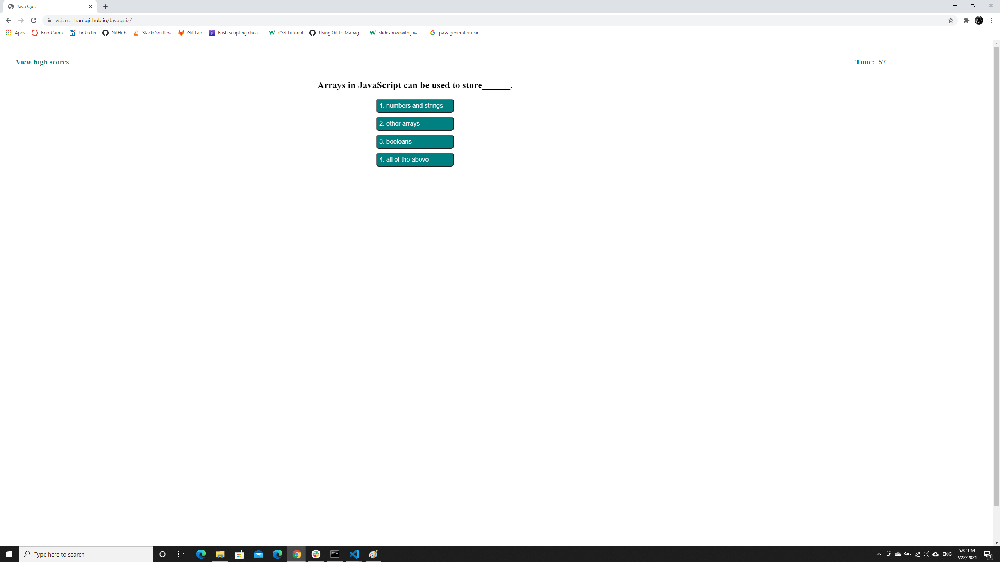

# JavaScript Quiz Contest

## Description
This is a webpage to display quiz on JavaScrpit. The quiz and the timer starts upon click the start quiz button. For each question 4 choices are provided. Answering or clicking on the choice button takes you to the next question. Every wrong answer takes off 10 seconds from the time left. The timer stops if all the questions are answered or if the time left is zero. Your score will be the time left on the timer. Good luck taking the Quiz.

## Live URL
Please find the website deployed here - [(https://vsjanarthani.github.io/JavaScriptquiz/)]

## Built With
* HTML
* CSS
* JavaScript

## Screenshot of the Deployed Webpage

## Contribution
Made with :heart: by **Janarthani V Subramaniam**